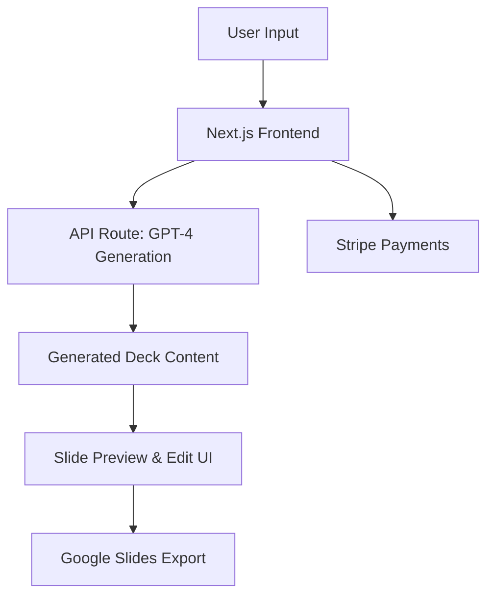

# PitchForge: Next.js App Overview

## Project Description
PitchForge is a Next.js application that helps founders quickly generate professional startup pitch decks from short text inputs. It leverages GPT-4 to create key pitch sections and integrates with Google Slides for export. Monetization is handled via Stripe.

---

## Features

- **AI-Powered Deck Generation:**  
    Uses GPT-4 to generate:
    - Company overview
    - Problem/solution statement
    - Market opportunity
    - Business model
    - Go-to-market strategy
    - Team bios

- **Google Slides Integration:**  
    Export generated decks directly to Google Slides via the Google Slides API.

- **Monetization:**  
    - Pay-per-export
    - Subscription plans  
    (Handled via Stripe integration)

- **User Interface:**  
    - Clean, modern UI (e.g., Tailwind CSS or Chakra UI)
    - Slide previews
    - Inline editing of generated content

---

## High-Level Architecture

---

## Key Tech Stack

- **Frontend:** Next.js, React, Tailwind CSS/Chakra UI
- **AI:** OpenAI GPT-4 API
- **Export:** Google Slides API
- **Payments:** Stripe API
- **Auth:** NextAuth.js (optional)

---

## Example User Flow

1. Founder enters short company description.
2. App generates pitch sections using GPT-4.
3. User previews and edits slides.
4. User pays (if required) via Stripe.
5. User exports deck to Google Slides.

---

## Next Steps

- Scaffold Next.js app: `npx create-next-app pitchforge`
- Set up GPT-4 API integration
- Build slide preview/edit UI
- Integrate Google Slides API
- Add Stripe payment flows
